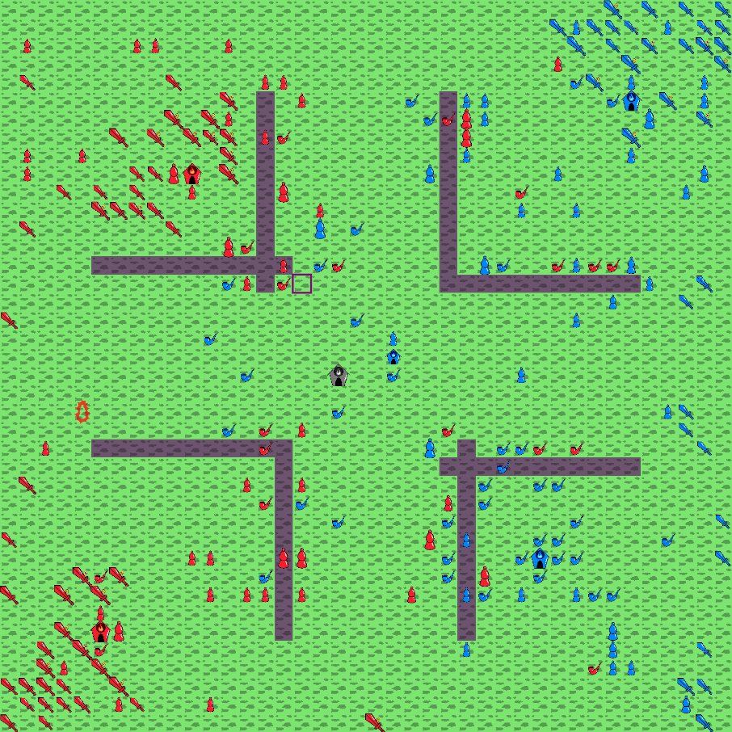

# Battlecode 2021

This repository stores the code for my bots, so check that out if you want. The newest and best bot is in `src/starfleet`.
The rest of this README is my postmortem.

# Postmortem

This was my first year doing Battlecode, and I really had a lot of fun.
A year or two ago, I did Halite 3 and I did Terminal for a little while, which are fairly similar, but I enjoyed Battlecode a lot more.
I think a lot of that is because of the "ant-brain" nature of Battlecode, where each unit runs an independent copy of the code and you need to come up with communication and coordination infrastructure yourself.
That made it a lot more interesting to me.

Although I did better than I expected to (I actually made it to the finals my first year!), I think I could have done better.
Here are some of the lessons I'm taking away from the experience, for next year or other future projects:

- Read the spec! Seriously, reread the entire spec several times during the first week.
This year, I didn't realize that ECs could see flags at any range until halfway through week 2, so my sprint 1 bot relayed messages through nearby units, which was a lot of complication and problems that could have been easily avoided.
Once I switched to EC-managed communication, it worked much better. I should have done that during week 1.

- There are mostly three phases of development: writing new code, debugging, and tweaking constants, build order, etc.
You don't want to be writing new code an hour before the deadline, and you also don't want to spend much time tweaking constants halfway through week 1.
I made both of those mistakes. I think ideally, the first half of each week would be pretty much only writing new code and testing new strategies.
The second half (or maybe just the last day for week 1) would be less of that, although some is fine unless it's the last day, but more debugging and tweaking.
Overall, I didn't explore enough early on and didn't do quite enough testing right before tournaments.

- Debugging and testing edge cases is important! I encountered maps in both sprint tournaments that were edge cases my bot couldn't handle.
Specifically, my starting EC (headquarters) was next to another EC.
In sprint 1, it was next to an enemy EC, and it actually tried to run away, but crashed because it's a building an can't run away.
In sprint 2, it was next to a neutral EC, which it saw as an enemy and so decided that it needed to keep enough money in the EC not to die to an attack, and didn't build anything for the first 50 turns, letting the opponent get a head start.
Neutral ECs can't actually attack you, so that wasn't a good decision.

## The Game



Battlecode 2021 consists of a set of units on a map. The map can be any size from 32x32 to 64x64, and it consists of tiles with a "passability" value between 0.1 (purple) and 1 (green).
A tile with passability 0.5 takes twice as long to cross as a tile with passability 1, and one with passability 0.1 takes ten times as long, but no obstacle is completely impassable.
The other feature on maps is enlightenment centers or ECs, which can belong to either player, or be neutral.
The map is symmetric, so that both players have an equal chance - it might be horizontally symmetric, vertically symmetric, or rotationally symmetric (pictured above).

Besides ECs, there are three types of robots: politicians, slanderers, and muckrakers. All three can move, but at different speeds - politicians are twice as fast as slanderers, and muckrakers are in between.
Each unit has a "conviction" or health value which is equal to its cost to create (except it's a little lower for muckrakers), and can be chosen freely, so teams can decide whether to build large or small units.

- The EC stores money or "influence", and can build a unit every other turn, so unit count is an important resource alongside influence.
It also gets a small amount of passive income each turn, and ECs belonging to a player start with 150 influence.
Neutral ECs don't do anything until one team captures them, then they turn into that team's EC. You can also capture and take over enemy ECs. An EC's health, its conviction, is equal to its influence.

- Politicians (they look like pawns) can "empower" or explode where they die and any units in a small radius around them take damage to their conviction based on the politician's conviction - note that when conviction goes negative, most units die, but politicians and ECs are simply converted to the opponent's side. Friendly units in that radius are healed that amount, up to their starting conviction.
Note that a "tax" of 10 conviction is taken off before damage is calculated, so large politicians are more efficient at dealing damage (a larger percentage of their conviction is transferred into damage), but it can be diluted easily if there are lots of nearby units, since damage is divided equally between nearby units, and damage past the maximum on any unit is wasted. So if a 100 conviction politician empowers at a 1 conviction muckraker and a 200 conviction EC, it will kill the muckraker and do 45 (`=(100-10)/2`) damage to the EC.
Theoretically, since only 46 damage was done in total, that's a lost 54 influence; however, it still might be worth it depending on the circumstances.

- Slanderers (they look like swords) passively make money, an amount based on their starting conviction, for their first 50 turns on the board. The slanderer income function is complex, and the optimal return comes from slanderers with a starting conviction of 949, so those are what you'll usually see in games between top players once they get set up.
Once the slanderer has been alive for 300 turns, it turns into a politician with equal conviction, so they're still very useful if you can keep them alive long enough.
Note that only muckrakers and ECs can tell the difference between slanderers and politicians, even friendly ones.

- Muckrakers (they look like pipes) can "expose" nearby slanderers and kill them. They can do this as often as they want, even if they have only 1 conviction, so most muckrakers have only 1 conviction to conserve money.
Exposing not only deprives the opponent of the slanderer, and thus a bunch of influence and a unit, but also increases the power of friendly politicians' empowering for 50 turns.
Specifically, politicians' speeches have their power multiplied by `1 + 0.001i`, where `i` is the total influence of all enemy slanderers exposed within the last 50 turns.
Before halfway through week 3, that function was instead `1.001^i`, which was too powerful so it was changed.
Also, that buff doesn't apply to friendly ECs, since otherwise you could multiply your influence by putting it into politicians that empower immediately, then doing it again.

There are two ways to win the game: either destroy all enemy units (this is more common), or stay alive until the end of the game at round 1500 and have more votes than the opponent.
There's one vote up for auction each round, and every EC can bid an amount of influence for that vote.
The EC that bids the most wins the vote for each team, and loses the influence it bid. The EC that bid the most on the enemy team loses half of its bid. All other ECs get their bid refunded.
Note that if both teams bid an equal amount, the vote goes to nobody. Additionally, you can't see your opponent's number of votes, only your own, and you can't tell what the opponent bid either.
So bidding is based on guessing, but you can't bid too much or you'll lose influence and die to annihilation.
Most games are decided by annihilation, so bidding isn't that useful, and some teams don't bid at all; it is helpful in some cases, though, so all finalists did bid, but usually not that much of their money.

So for most teams, strategy amounts to trying to take over neutral and enemy ECs while making and protecting slanderers to make more money than the opponent, as well as trying to attack enemy slanderers to increase your income lead on the opponent.
This is the "economy" strategy, and it usually leads to one team having a huge influence advantage and control of most of the map, and they can then annihilate the opponent's remaining units pretty easily.
Each EC gives you a bit of passive influence, but having more ECs is mostly useful because it lets you increase your unit count faster, and build more slanderers.

There's another strategy called "muckraker rush" where you build muckrakers as fast as possible, so that they destroy the opponent's economy quickly and you can take over the map, then spawn some slanderers and win on votes once you have map control.
The main way to defend against muckraker rush is by empowering small politicians at locations where they can kill multiple muckrakers, since each muckraker generally only has 1 conviction.
That lets you get a unit count lead on the opponent, and from there you can keep muckrakers out for long enough to build slanderers and get a huge influence lead, then take over the opponent's ECs.
For muckraker rush to work, you need to counter that effectively, which is usually done by making sure muckrakers are spread out enough that the enemy can't get double kills.
The muckraker rush strategy was less useful after the muckraker buff was reduced and self-empower removed, but one muckraker rush team did make it to the finals.
All other finalists, including me, used variants of the economy strategy.

A couple of other strategy notes:

- I mention above that most muckrakers have only 1 conviction, since they can still expose freely. Because of that, most teams' defenses are optimized to counter these very small muckrakers.
So, towards the end of the competition, many top teams started sometimes producing "buffrakers", which are muckrakers with very high conviction.
These buffrakers are hard to kill with the small politicians that usually guard slanderers, so they can often get past and expose slanderers.
The main counter for this strategy is to notice when you see a buffraker, then build some guard politicians with just enough conviction to kill buffrakers of that size, so that next time you see one you'll be prepared.

- Scouts are important for finding things like neutral and enemy ECs and map edges. Most teams, including me, use muckrakers as scouts, since they have the largest vision radius and having them wandering around trying to find slanderers is a good idea anyway.
Some teams use politicians, since they're faster.
Theoretically, slanderers also have advantages, since both muckrakers and politicians can't move for 10 turns after creation, but slanderers can; slanderers are slower, though, and easily killed by enemy muckraker scouts, so nobody actually uses them as scouts.

- There are two kinds of lattices that are useful. First, a dense lattice of slanderers, where a slanderer is on every other tile, is useful to allow free movement through the group of slanderers (since units can move diagonally).
This is important because slanderers in the middle of the group will eventually convert into politicians, and it's important to get those big politicians out of the slanderer group and attacking the enemy. Also, the slanderer group often surrounds its home EC, so when a unit is spawned it needs to be able to get out.

- The other useful type of lattice is a sparser lattice of politicians, which can see and attack every tile in the area covered by the lattice.
They can see incoming muckrakers and communicate the information through the EC to slanderers, so that the slanderers can keep far away from enemy muckrakers.
That's also a good way to get the politicians to spread out to be ready to block or destroy muckrakers that are already close to slanderers.

### Communication

Units each compute independently and can only see in a small area around them.
The only way of communicating is with "flags": each unit has a flag, a 24-bit number that can be changed each turn and read by nearby units and any ECs that know that unit's ID.
Likewise, an EC's flag can be read by any unit with that EC's ID.
So, teams have to come up with a way of storing anything they want to communicate in those 24 bits.
One important thing is that you don't generally know how big the map is or where the edges are, and absolute locations are offset by a number between 10,000 and 30,000, so you an absolute location is too big to be stored in a flag.
I used coordinates relative to the home EC of the unit sending the message, or the EC itself if it's an EC sending the message.
I also used a bit in my flags to convey whether that unit is a slanderer, since politicians need to protect friendly slanderers and can't tell the difference between those and other friendly politicians.
Here's what my flags looked like at the end, by bits:

```
0 0000 0000 0 00 000000 000000
╤ ╤═══ ╤═══ ╤ ╤═ ═════════════── absolute value of x and y coordinates relative to home EC
│ │    │    │ └ signs of x and y coordinates
│ │    │    └ a one-bit flag used for various message-type-specific things
│ │    └ if this message describes a neutral EC or a muckraker, how much conviction it has, on a log scale
│ └ four-bit header identifying the type of message
└ if it's a slanderer
```

Examples of message types are reporting a newly found enemy or neutral EC, a previously unknown map edge, and an EC reporting its income so politicians can use it in expected value calculations.
Also, the location slot could instead store a 15-bit unit ID for certain message types.

### Bytecode (and strings)

A limit on computation time per unit is obviously an important thing to have. The problem is, time is non-deterministic and depends on external factors like computer speed and how busy the servers are right now.
Instead, since all bots are written in Java, Battlecode uses Java bytecode instructions to measure computation time, which are completely deterministic and hardware-independent.
There are a couple of exceptions, for example creating an array of length 300 is one instruction, but counts as 300 bytecodes.
Also, certain build-in or Battlecode-specific functions have fixed bytecode costs: `MapLocation.distanceSquaredTo()` and `Math.sin()` both cost 1 bytecode, and `rc.getFlag()` costs 5.
Bytecode limits per-unit are pretty low, so you have to work to stay within them if you're doing much computation.

There's one thing that's a little weird, and that's string operations. Most string operations are 1 bytecode, so it costs 1 bytecode to add a string to a `StringBuilder`, remove a section, or check if it contains a string.
That lets you use strings as a very efficient set data structure, which I implemented in `starfleet.StringSet` and only used a little bit.
I know some teams didn't want to use strings because they felt like cheating, and for the same reason I didn't use them for anything complicated like a pathfinding cache, only for checking whether we had already seen a unit or muckraker to avoid adding it to a list again.

To optimize bytecode usage, I often used the `javap` tool to disassemble my classes and see what instructions were being called inside loops.
I think my loop for reading flags of all units that an EC owns, for example, is pretty close to optimal in terms of bytecode use. Still, in the end, my politicians calculated maximum empower damage for each possible move direction, which often made them go overtime and sometimes miss a turn they could have acted. That ended up doing more good than harm, so I kept it. I know at least one team was able to implement the same thing with vastly lower bytecode costs, and I'm certainly interested to see how they did it.

### Navigation

No obstacle is truly impassable, but waiting an extra 10 turns to move again for going over a passability 0.1 tile isn't good.
So, some form of pathfinding is a good idea, but complex pathfinding uses a lot of valuable bytecode.
What I ended up with was a very simple system where units move to the adjacent tile with the highest passability that was strictly closer to the unit's destination that where it currently was, so no backtracking was allowed.
This didn't always find the shortest path, but it worked pretty well and was cheap to compute.

## Progress

I had three bots, pretty much one for each week. The first bot was `testplayer`, which only communicated between nearby units because I didn't realize that ECs had unlimited range for flags.
It had a vaguely offensive strategy, but also did such useful activities as sending slanderers right into enemy territory where they would be killed instantly.
That's the bot I submitted for sprint 1, and it did okay - I think I was rank 30 something, on the fourth page.

Next, I wrote `redarmy`, which was a more defensive strategy, with a ring of slanderers around the EC and then a larger ring of politicians around that to defend them.
I realized that EC-based communication was a thing and switched to it. This strategy was inspired by babyducks' early defensive strategy.
I submitted `redarmy` for sprint 2, and I think I got to the bottom of page three (rank in the high 20s).

Then in the third week, I switch to `starfleet`, which uses a sparse lattice of politicians and a dense lattice of slanderers, and communicates muckraker locations so that the slanderer group stays away from enemy muckrakers.
When self-empowering was removed, and I switched to an expected damage calculation for empowering that weighs unit count according to income, I made it to rank 20 or so - the ratings were pretty volatile, so I pretty much went back and forth between rank 15 and 25.
There were a couple other important improvements, like guessing where enemy ECs are based on map symmetry.
This is why I think I should have spent more time writing new code earlier - I had most of these ideas in week 2, and I would have had time to implement them then if I hadn't spent so much time tweaking prematurely.
Tweaks are never going to make your bot that much better, so unless you're near the top already I think they're not that important.

Even after the update that removed self-empower, which made it much less bad when your slanderers get exposed, my bot's biggest weak point was defending its slanderers.
Most of the times it lost, it was because the enemy had found its poorly-defended slanderers and killed them, eliminating its income and getting a large buff.
I think maybe the biggest general thing that was hard for me was getting my units to move in the patterns I wanted them to - usually my guards weren't distributed well to protect the slanderers, and I never improved that much.
I think that was the biggest problem with my defense.
Likewise, my scouts never did a very good job exploring, which meant I took longer to take over neutral ECs and the other team got a head start on building units.
